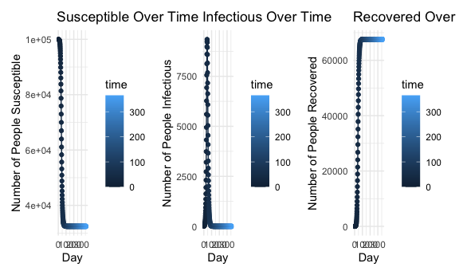
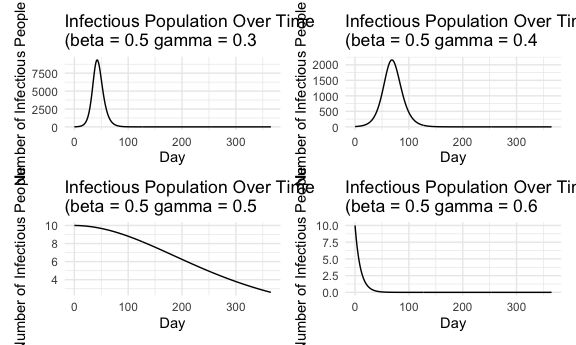
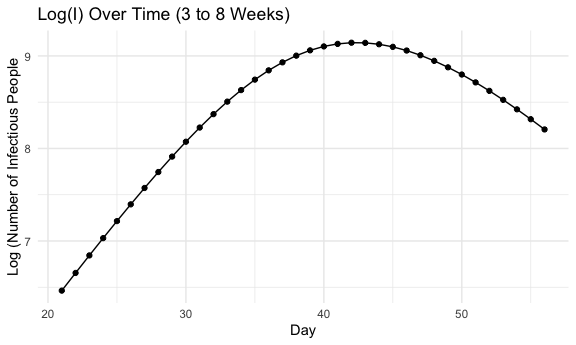
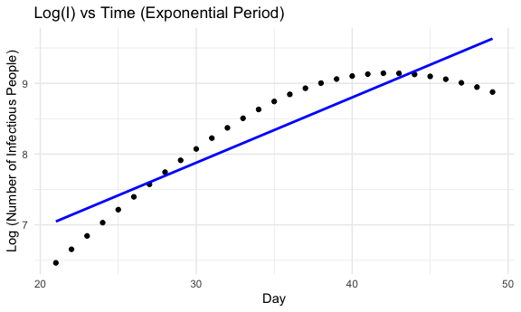
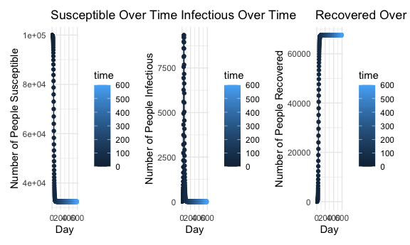

Lab 3
================

``` r
knitr::opts_chunk$set(
        echo = TRUE,
        warning = FALSE,
  fig.width = 6,
  fig.asp = .6,
  out.width = "90%"
)

theme_set(theme_minimal() +theme(legend.position = "bottom"))

options(
  ggplot2.continuous.color = "viridis",
  ggplot2.continuous.fill = "viridis"
)

scale_color_discrete = scale_colour_viridis_d
scale_fill_discrete = scale_fill_viridis_d
```

``` r
SIR=function(t,state,parameters){
  with(as.list(c(state,parameters)),{
    # rate of change
    dS = -beta*S*I/N;
    dI= beta*S*I/N - gamma*I;
    dR = gamma*I;
    
    # return the rate of change
    list(c(dS, dI, dR))
  }) # end with(as.list...)
}
```

``` r
N=1e5; # population size
I0=10; # initial No. of Infectious people
S0=N-I0;  # initial No. of Susceptible people
R0=N-I0-S0 # initial No. of Recovered people
state=c(S=S0, I=I0, R=R0);  # store the initial conditions I & S together 
parameters=c(beta=.5,gamma=.3);  # store the model parameters, unit: per day
```

# Part 1: Find the final epidemic size using simulation

## Question 1

Compute and plot R over time for the following epidemic setting. What is
the final epidemic size (i.e. R at the end of the epidemic)?

``` r
beta=.5; gamma=.3;
parameters=c(beta=beta,gamma=gamma)
times=seq(0,365,by=1)  # run for a year
state=c(S=S0,I=I0, R=R0)
sim=ode(y=state,times=times,func=SIR,parms=parameters)
```

``` r
q1_susceptible = ggplot(sim, aes(x = time, y = S, color = time)) +
  geom_point() +
  geom_line() +
  labs(title = "Susceptible Over Time", 
       x = "Day", 
       y = "Number of People Susceptible") +
  theme_minimal()
```

``` r
q1_infectious = ggplot(sim, aes(x = time, y = I, color = time)) +
  geom_point() +
  geom_line() +
  labs(title = "Infectious Over Time", 
       x = "Day", 
       y = "Number of People Infectious") +
  theme_minimal()
```

``` r
q1_recovered = ggplot(sim, aes(x = time, y = R, color = time)) +
  geom_point() +
  geom_line() +
  labs(title = "Recovered Over Time", 
       x = "Day", 
       y = "Number of People Recovered") +
  theme_minimal()
```

``` r
q1_model = q1_susceptible + q1_infectious + q1_recovered

q1_model
```



``` r
sim_df = as.data.frame(sim)
sim_df$week = ceiling(sim_df$time / 7)

weekly_data = sim_df |> 
  group_by(week) |> 
  summarize(
    S_weekly = mean(S),
    I_weekly = mean(I),
    R_weekly = mean(R)
  )
```

The final epidemic size or R at the end of the epidemic is 67582.73.

# Part 2: Test the epidemic threshold

## Question 2

What are the differences among the simulations? Explain what you see.

``` r
run_simulation = function(beta, gamma) {
  parameters = c(beta = beta, gamma = gamma)
  state = c(S = S0, I = I0, R = R0)
  
  sim = ode(y = state, times = times, func = SIR, parms = parameters)
  
  sim_df = as.data.frame(sim)
  return(sim_df)
}


params_list = list(
  list(beta = 0.5, gamma = 0.3), 
  list(beta = 0.5, gamma = 0.4), 
  list(beta = 0.5, gamma = 0.5), 
  list(beta = 0.5, gamma = 0.6)
)

simulations = lapply(params_list, function(params) {
  run_simulation(params$beta, params$gamma)
})
```

``` r
plot_list = lapply(1:length(simulations), function(i) {
  sim_df = simulations [[i]]
  ggplot(sim_df, aes(x = time, y = I)) +
    geom_line() +
    labs(title = paste("Infectious Population Over Time\n(beta =", params_list[[i]]$beta, "gamma =", params_list[[i]]$gamma), 
         x = "Day", 
         y = "Number of Infectious People") +
    theme_minimal()
})
```

``` r
plot_list[[1]] + plot_list[[2]] + plot_list[[3]] + plot_list[[4]]
```



When the gamma is smaller ot R0 is larger, the epidemic curve grows more
quickly and has a larger peak, leading to faster transmission. When the
gamma is larger or R0 is smaller, the epidemic curve grows slowly and
has a lower peak, leading to slower transmission.

When gamma increases from 0.3 to 0.4, the peak of the curve is slightly
lower. Where gamma is 0.5, the curve appears almost linear in the
negative direction. Where gamma is 0.6. the epidemic curve is negatively
exponential with no significant peak.

# Part 3: Test the exponential period

## Question 3

Plot log(I) vs t (try t=3 to 8 weeks) and see when the exponential
period ends.

``` r
beta=.5; gamma=.3;
parameters=c(beta=beta,gamma=gamma)
times=seq(0,100,by=1) 
state=c(S=S0,I=I0, R=R0)
sim=ode(y=state,times=times,func=SIR,parms=parameters)
```

``` r
subset_sim = sim_df |> 
  filter(time >= 21 & time <= 56)
```

``` r
subset_sim$log_I = log(subset_sim$I)
```

``` r
log_infectious = ggplot(subset_sim, aes(x = time, y = log_I)) +
  geom_point() +
  geom_line() +
  labs(
    title = "Log(I) Over Time (3 to 8 Weeks)", 
    x = "Day", 
    y = "Log (Number of Infectious People") +
  theme_minimal()

log_infectious
```



The exponential period ends when the curve reaches its peak at around
Day 42. At this point, growth rate begins to slow down and number of
infectious people begins to decrease or decline.

## Question 4

Fit log(I) to t over the exponential period, and find the slope of the
linear regression. What does the slope represent?

``` r
exp_growth = subset_sim |> 
  filter(time>= 21 & time <= 49)
```

``` r
exp_growth_lm = lm(log_I ~ time, data = exp_growth)
```

``` r
slope = coef(exp_growth_lm) [2]

slope
```

    ##       time 
    ## 0.09227904

``` r
exp_growth_plot = ggplot(exp_growth, aes(x = time, y = log_I)) +
  geom_point() +
  geom_smooth(method = "lm", se = FALSE, color = "blue") +
  labs(title = "Log(I) vs Time (Exponential Period)", 
       x = "Day", 
       y = "Log (Number of Infectious People)") +
  theme_minimal()

exp_growth_plot
```

    ## `geom_smooth()` using formula = 'y ~ x'



The slope of the linear regression is 0.0923. The slope represents the
exponential growth rate or transmission rate (beta) of the infectious
population, indicating how quickly the disease spreads.

# Part 4: Epidemic burnout

## Question 5

Show your results and check the final S and I (is S=0? is I=0). Why does
the epidemic die out eventually?

``` r
beta=.5; gamma=.3;
parameters=c(beta=beta,gamma=gamma)
times=seq(0,600,by=1) 
state=c(S=S0,I=I0, R=R0)
sim=ode(y=state,times=times,func=SIR,parms=parameters)
```

``` r
q5_susceptible = ggplot(sim, aes(x = time, y = S, color = time)) +
  geom_point() +
  geom_line() +
  labs(title = "Susceptible Over Time", 
       x = "Day", 
       y = "Number of People Susceptible") +
  theme_minimal()
```

``` r
q5_infectious = ggplot(sim, aes(x = time, y = I, color = time)) +
  geom_point() +
  geom_line() +
  labs(title = "Infectious Over Time", 
       x = "Day", 
       y = "Number of People Infectious") +
  theme_minimal()
```

``` r
q5_recovered = ggplot(sim, aes(x = time, y = R, color = time)) +
  geom_point() +
  geom_line() +
  labs(title = "Recovered Over Time", 
       x = "Day", 
       y = "Number of People Recovered") +
  theme_minimal()
```

``` r
q5_model = q5_susceptible + q5_infectious + q5_recovered

q5_model
```



Over time, by day 600, the number of individuals that are susceptible
and infectious drops to 0. Therefore, the transmission rate drops as
fewer individuals can contract the disease.
